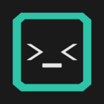
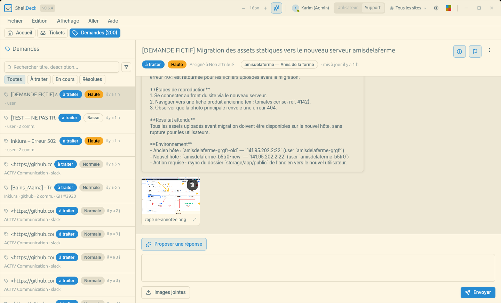
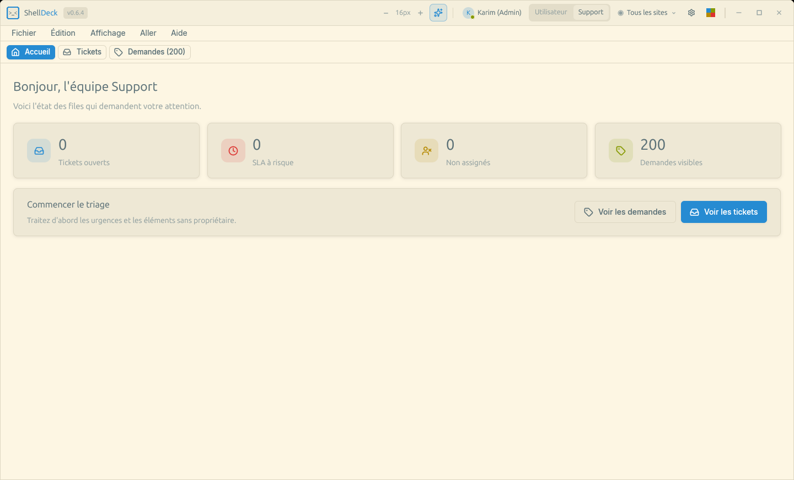
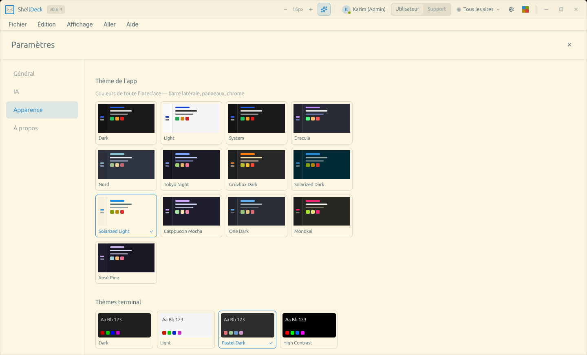
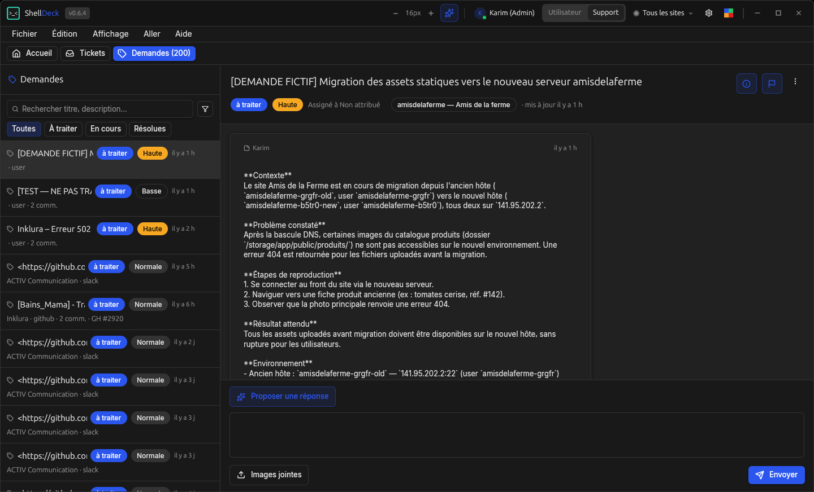

# ShellDeck

<p align="center">
  
</p>

A GPU-accelerated native desktop SSH, terminal, and operations companion built
with Rust. ShellDeck brings infrastructure work, Inklura Manage sites, support
requests, and automation into one role-aware control plane.

## Preview

<p align="center">
  
</p>

<table>
  <tr>
    <td align="center"><strong>Support overview</strong></td>
    <td align="center"><strong>App and terminal themes</strong></td>
  </tr>
  <tr>
    <td></td>
    <td></td>
  </tr>
</table>

<details>
  <summary>Dark theme preview</summary>
  <br />
  
</details>

## Features

- **GPU-Accelerated Rendering** -- Native performance via [GPUI](https://gpui.rs) framework
- **SSH Connection Manager** -- Auto-imports from `~/.ssh/config`, supports jump hosts, key auth, and password auth via OS keychain
- **Terminal Emulator** -- Full VTE escape sequence support (SGR, CSI, OSC), scrollback, alt screen buffer, BCE
- **Nested Pane Layouts** -- tmux-like recursive split tree (N panes, mixed horizontal/vertical) with drag-to-resize dividers and click/keyboard focus
- **Port Forwarding** -- Local, remote, and SOCKS proxy tunnels with visual status
- **Script Editor** -- Write, save, and execute scripts on remote hosts with variable templating
- **Server Sync** -- Side-by-side file browser, nginx/database discovery, rsync/mysqldump/pg_dump sync wizard
- **Command Palette** -- Fuzzy-filtered command search (`Ctrl+Shift+P`)
- **Session Persistence** -- Restore workspace layout and sessions across restarts
- **Search** -- In-terminal text search with match highlighting
- **URL Detection** -- Clickable URLs detected in terminal output
- **Themes** -- 13 built-in app themes (Dracula, Nord, Tokyo Night, Gruvbox, Catppuccin, …) plus terminal color themes, with live preview via the titlebar switcher and command palette
- **Cloud Sync** -- Pull SSH connection profiles from the [Inklura Manage](https://manage.inklura.fr) portal into your connection store
- **Role-Aware Workspaces** -- Dedicated User, Support, and Dev surfaces gated by the signed-in Manage account
- **Support & Requests** -- Triage support tickets and manage tenant/site requests with comments, attachments, GitHub sync, and fleet dispatch
- **Contextual AI** -- Native AI Dock plus Monique and Fleet integrations for assisted operations
- **Auto-Update** -- Checks for and installs new releases automatically
- **Context Menu** -- Right-click for copy, paste, search, and URL actions
- **Git Integration** -- Branch indicator and status in the UI

## Install

Download the latest release from **[shelldeck.1clic.pro](https://shelldeck.1clic.pro)** (Linux AppImage/tarball, macOS DMG, Windows installer), or use the install script:

```bash
# Linux / macOS
curl -fsSL https://shelldeck.1clic.pro/install.sh | bash
```

```powershell
# Windows
powershell -c "irm shelldeck.1clic.pro/install.ps1 | iex"
```

ShellDeck auto-updates itself once installed. To build from source instead, see below.

## Requirements

- **Rust nightly**, pinned in `rust-toolchain.toml` (do not change to floating `nightly` — it breaks the macOS build; see `CLAUDE.md`)
- **Linux**: OpenSSL, Wayland/X11, Vulkan, D-Bus, GTK 3, and AppIndicator development packages (see the command below)
- **macOS**: Xcode Command Line Tools, OpenSSL, and pkg-config (`brew install openssl pkg-config`)
- **Windows**: Visual Studio Build Tools with the Desktop development with C++ workload

Companion shortcuts invoked from another application require the macOS
permissions described in
[`docs/macos-permissions.md`](docs/macos-permissions.md).

### Install system dependencies (Ubuntu/Debian)

```bash
sudo apt install \
  libssl-dev pkg-config libxkbcommon-dev libwayland-dev libvulkan-dev \
  libfontconfig1-dev libxcb-shape0-dev libxcb-xfixes0-dev libxcb1-dev \
  libxkbcommon-x11-dev libdbus-1-dev libgtk-3-dev libxdo-dev \
  libayatana-appindicator3-dev
```

## Build & Run

```bash
# Clone
git clone https://github.com/benfavre/shelldeck.git
cd shelldeck

# Build
cargo build

# Run
cargo run

# Run in release mode
cargo run --release
```

On Linux you may need to set `PKG_CONFIG_PATH` if OpenSSL isn't found:

```bash
PKG_CONFIG_PATH=/usr/lib/x86_64-linux-gnu/pkgconfig cargo build
```

## Project Structure

```
shelldeck/
├── crates/
│   ├── shelldeck/            # Binary crate -- app entry point, keybindings
│   ├── shelldeck-core/       # Models, config, SSH config parser, keychain
│   ├── shelldeck-ssh/        # SSH client, sessions, tunnels, remote exec
│   ├── shelldeck-terminal/   # PTY, VTE parser, terminal grid
│   ├── shelldeck-ui/         # GPUI views, sidebar, dashboard, forms
│   └── shelldeck-update/     # Signed update checks and installation
├── patches/
│   └── adabraka-gpui/        # Patched GPUI fork
├── Cargo.toml                # Workspace manifest
└── rust-toolchain.toml       # Nightly toolchain
```

## Configuration

ShellDeck stores its state in the platform configuration directory returned by
the operating system. On Linux this is `$XDG_CONFIG_HOME/shelldeck/`, or
`~/.config/shelldeck/` when `XDG_CONFIG_HOME` is not set.

| File | Purpose |
|------|---------|
| `config.toml` | App settings, account, integrations, theme, and keybindings |
| `connections.json` | Saved connections, scripts, port forwards |
| `workspace.json` | Window layout and session state |

SSH credentials are stored securely in your OS keychain -- never in config files.

## Cloud Sync (Inklura Manage)

ShellDeck can pull SSH connection profiles from the [Inklura Manage](https://manage.inklura.fr) portal so a team's server inventory stays in sync across machines. Synced connections show up alongside your `~/.ssh/config` and manual entries, tagged as **cloud**-sourced; they are refreshed on every sync and removed automatically when they disappear from the portal. Your local **manual** and **SSH-config** connections are never modified by sync.

### Sign in from the titlebar

The quickest way to connect is the **account chip in the titlebar** (top-right, next to the theme switcher). Click **Se connecter** and either:

- enter your Inklura Manage **email + password**, or
- use **single sign-on** — *SSO 1clic.pro*, *Google*, or *GitHub*. This opens your system browser to authorize the device, then hands a token back to ShellDeck automatically.
- or **Via le navigateur (mot de passe)** — opens the browser to the Manage password login page (handy when you already have a Manage session or a browser password manager), then authorizes and returns.

On success ShellDeck stores an account-bound sync token, enables Cloud Sync, and pulls your profiles. The chip then shows your name and a status dot (green = connected, gray = offline/unchecked, red = token rejected — sign in again). Use the chip's dropdown to **Synchroniser** on demand or **Se déconnecter** (which revokes the token server-side).

### Sites & Manage areas

Once signed in, a **site chip** appears in the titlebar (next to the account chip). It shows the active site — or **Tous les sites** — and its dropdown lets you:

- **Switch the active site**: the list pins the active site and sites that have connections to the top. Selecting one scopes the sidebar to that site's connections (plus your unbound manual/SSH entries); **Tous les sites** clears the filter. Connections bound to a site show a small site badge. The choice is remembered across restarts.
- **Open a Manage area** for the active site: each area (Dashboard, CMS, Helpdesk, E-commerce, Settings, …) opens in your browser, already scoped to that site.

The command palette (`Ctrl+Shift+P`) also has a **Switch Active Site** entry and, when a site is active, one **Site actif (…) : \<area\>** entry per area.

### Manual configuration

You can also configure Cloud Sync by hand — add a `[cloud_sync]` section to
`config.toml` in ShellDeck's platform configuration directory:

```toml
[cloud_sync]
enabled = true
base_url = "https://manage.inklura.fr"
token = "sd_..."          # get a token at manage.inklura.fr/manage/shelldeck
sync_on_startup = true     # pull profiles automatically at launch
```

- **Get a token** at [manage.inklura.fr/manage/shelldeck](https://manage.inklura.fr/manage/shelldeck).
- With `sync_on_startup = true`, ShellDeck syncs at launch (bounded by a 4s connect / 10s total timeout, so a portal outage never blocks startup).
- Trigger a sync anytime via the command palette (**Cloud Sync Now**) or the **Sync now** button under Settings → General → Cloud Sync.
- The token is stored in `config.toml`; the Settings screen only ever shows a masked hint of it.

## App modes (User / Support / Dev)

The surfaces available in the titlebar mode switcher depend on the signed-in
Inklura Manage account:

- **User** — available to every authenticated account. It provides dedicated **Accueil**, **Mes sites**, **Mes demandes**, and **Mes informations** tabs with one-click Manage links and account-scoped data.
- **Support** — a native two-pane helpdesk console for support.inklura.fr: view filters (Tous / Non attribués / Les miens / Ouverts / En attente / SLA / Résolus) with live counts, the ticket list, and a conversation pane with a reply/note composer and an action bar (status, priority, assign, resolve). The list refreshes every ~30s while open.
- **Dev** — the full ShellDeck workspace: terminals, SSH, port forwards, scripts, server sync, sites, Monique, Fleet, and bext Cloud.

Regular and customer-admin accounts are restricted to User mode. Accounts with
the dedicated `inklura_support` role can switch between User and Support.
Super-admins can access all three modes. The switcher and command palette only
show modes the account can reach.

Switching modes never closes running terminal sessions — Dev surfaces are
hidden, not destroyed. The selected mode is remembered across restarts. When
no account is signed in, ShellDeck displays its mandatory welcome and login
screen; Dev mode is never used as a logged-out fallback.

## Monique / Automonique

ShellDeck includes a native staff console for Monique, the production Automonique runtime. It reads typed health, generation, queue, reconciliation and process state, shares Monique's durable dashboard conversation, and presents any state-changing Manage action for an explicit approve/reject decision.

The console is available only to super-admins with a complete configuration, sourced with this precedence:

1. A local `[monique]` section in `config.toml` (wins — useful for a local tunnel):
   ```toml
   [monique]
   url = "https://monique.1clic.pro"
   user = "ops"
   pass = "…"
   ```
2. Otherwise the config delivered by the server in the sites feed (super-admin tokens only).

Basic credentials are sent only to the configured canonical URL; redirects are refused. ShellDeck has no alternate bot transport or fallback.

### Fleet runtime

Beyond controlling one dashboard, ShellDeck can be a **runtime for the Monique fleet** — the tenant/site-aware set of Monique instances managed from `manage.inklura.fr`. In Dev mode, the **Fleet** view shows every instance (name, tenant/site, runtime, status dot, heartbeat age), the recent-jobs feed, and a toggle to make **this machine** a runtime.

When enabled, ShellDeck registers itself, heartbeats, and claims pending jobs for its instance, executing each by driving **headless Claude Code** (`claude -p`, subscription auth) in the configured working directory.

⚠️ **Safety.** Executing a job runs Claude Code with file/edit/command powers on this machine. It is **off by default** and gated hard:

- The runtime only runs when `[monique_runtime].enabled = true` **and** the instance's autonomy is **`auto`**.
- An instance set to **`confirm`** never auto-runs — each claimed job appears in the Fleet view with **Exécuter / Rejeter** and waits for an explicit click. New instances default to `confirm`.
- One job at a time per machine.

```toml
[monique_runtime]
enabled = false          # default — must be turned on explicitly
# instance_id = "…"      # filled in after the first registration
# workdir = "/home/you/infra"
# name = "my-machine"
```

Toggle it from the Fleet view or the command palette (**Fleet : activer / désactiver ce runtime**, **Fleet : ouvrir la flotte Monique**).

## Requests (hosted issue management)

ShellDeck has a built-in **request tracker** — per tenant/site issues that are synced to GitHub and can be dispatched to the Monique fleet.

- **User mode** — a dedicated **Mes demandes** tab: file a **Nouvelle demande** (title + details + priority), see your tenant's requests with their status and GitHub number, and open any one to read its body/comments and add your own. The quick **Ask Monique** card stages one-off operational asks through the same reviewed conversation workflow.
- **Support mode** — a **Demandes** tab in the console: the request queue for your scope (all tenants for staff). Open a request to see its thread and comment; staff get a triage action bar — set status, cycle priority, assign to me, **Dispatcher** to a tenant Monique instance, and **Créer sur GitHub** / refresh from GitHub. Any support ticket can be **Convertir[i] en demande** to become a tracked request.

Staff-only actions are gated server-side; the action bar only appears for staff tokens. Palette: **Nouvelle demande**, **Demandes (support)**.

## bext Cloud

A **bext Cloud** view in Dev mode integrates the hosted control plane at [cloud.bext.dev](https://cloud.bext.dev) and lets you manage a single bext instance directly. Open it from the Go menu or command palette. It has two tabs:

- **Cloud** — **Se connecter** signs in through your browser (the cloud CLI OIDC flow via auth.1clic.pro; the token is stored in `[bext_cloud]` of `config.toml`). Once connected: your identity (with a super-admin badge), a **dashboard** stat strip, and a **Sites** panel — the one-click WordPress sites with status and primary domain (open-in-browser), a **Nouveau site WordPress** form, and per-site **Mettre en ligne / Config / Détruire** (destroy asks to confirm). Super-admins also see the **bext instances** the cloud knows about with health/status. The list polls every ~15s while open.
- **Instance** — manage the sites on one bext box directly through its loopback site SDK (`/__bext/sdk/site/*`): set a target base URL + app-id, list/create sites, and go-live/destroy them.

Each SSH connection has a **bext** hover action that opens the Instance tab for that box. (v1 targets the local loopback `http://127.0.0.1` — managing a remote box over an SSH tunnel is the next step.) Palette: **bext Cloud : se connecter / ouvrir**.

## Keyboard Shortcuts

Use `Ctrl` on Linux/Windows and `Cmd` on macOS unless noted otherwise.

| Shortcut | Action |
|----------|--------|
| `Ctrl/Cmd+Shift+P` | Command palette |
| `Ctrl/Cmd+K` | Quick connect |
| `Ctrl/Cmd+Shift+K` | Contextual AI assistant |
| `Ctrl/Cmd+T` | New terminal |
| `Ctrl/Cmd+W` | Close tab |
| `Ctrl/Cmd+B` | Toggle the sidebar panel |
| `Ctrl/Cmd+,` | Settings |
| `Ctrl/Cmd+E` | File editor |
| `Ctrl/Cmd+F` | Search in terminal |
| `Ctrl/Cmd+L` | Clear terminal |
| `Ctrl/Cmd+=`, `Ctrl/Cmd+-`, `Ctrl/Cmd+0` | Zoom in, out, or reset |
| `Ctrl+Tab`, `Ctrl+Shift+Tab` | Next or previous tab |
| `Ctrl+Shift+C/V` (Linux/Windows), `Cmd+C/V` (macOS) | Copy or paste |
| `Ctrl+Shift+D` (Linux/Windows), `Cmd+D` (macOS) | Split horizontally |
| `Ctrl+Shift+Alt+D` (Linux/Windows), `Cmd+Shift+D` (macOS) | Split vertically |
| `Alt+[` | Move focus between split panes |
| `Ctrl/Cmd+Q` | Quit |

## Contributing

See [CONTRIBUTING.md](CONTRIBUTING.md) for guidelines.

## License

[MIT](LICENSE)
