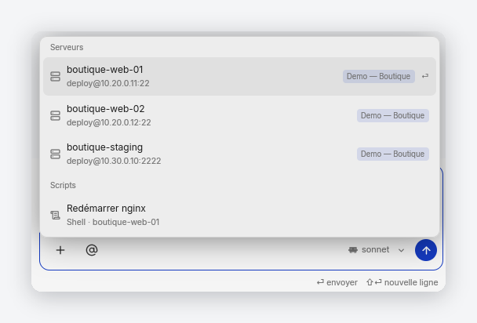
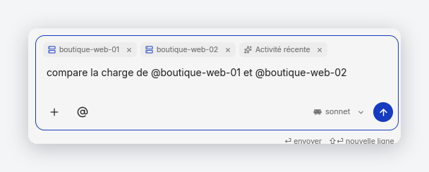
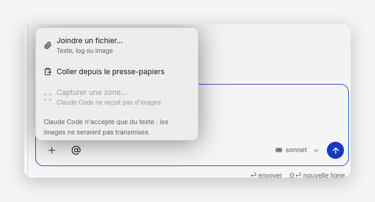
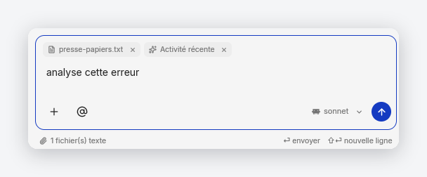
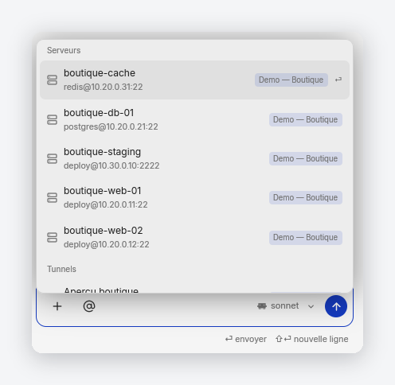

# Assistant composer — attachments (`+`) and mentions (`@`)

The AI composer footer carries two affordances that shipped as drawn-but-inert
placeholders (`ai.composer.attach_soon` / `ai.composer.target_soon`): a `+` and
an `@`. This document is the contract for making them real, in both hosts —
the workspace **Sheet** and the standalone **Dock** window.

- `+` — **attachments**: local bytes the user chooses to send with the turn.
- `@` — **mentions**: a typed, resolved reference to *something ShellDeck
  already knows about*, so the model can be told precisely which server,
  request, ticket, terminal or person the question is about.

The two are deliberately different mechanisms. Attachments are bytes and are
**not portable across backends** (a CLI backend invoked with `-p` and no tools
cannot receive an image). Mentions are *structured text* and therefore work
identically on every backend — which is exactly why the `@` path is the one
that carries application meaning.

## Aperçu

Captures prises sur un profil de démonstration entièrement fictif (hôtes,
scripts, tunnels et site inventés, compte factice, aucune donnée réelle).

| | |
|---|---|
|  |  |
| Le `@` ouvre un picker groupé par type, chaque ligne portant son badge de site. | Une mention acceptée écrit `@Label` dans le texte et pose une puce retirable. |
|  |  |
| Le `+` désactive les entrées image sur un backend qui ne peut pas les recevoir, et dit pourquoi. | Une pièce jointe texte est portée par toutes les IA ; le compteur indique ce qui partira. |



Le dock externe et la surface intégrée partagent le même code : le picker s'y
ouvre à l'identique, borné par le rail d'activités.

---

> **Related:** [`.agents/ai.md`](../.agents/ai.md) (safety contract),
> [`.agents/ai-mentions.md`](../.agents/ai-mentions.md) (the short rules),
> [`.agents/roles.md`](../.agents/roles.md) (who may see what),
> [`docs/clippy.md`](clippy.md) (the other untrusted-context surface).

---

## 1. Why mentions, and why they are not attachments

`AiContext.data` already ships "the current screen" as JSON. That answers
*where the user is*, not *what the user means*. Three concrete failures the
context chip cannot fix:

1. The user is on the dashboard and asks about a server that is not on screen.
2. The user is in Support on ticket A and wants a comparison with request B.
3. The user says "sur le serveur de prod" and there are four hosts whose alias
   contains `prod`.

A mention resolves the ambiguity **client-side, before the model sees it**: the
turn carries the entity's real id, its canonical fields and its site binding.
The model never has to guess which record was meant, and — this matters for the
action router in `complete_assistant_turn` — a routed action gets a
non-ambiguous target.

## 2. Wire format

`AiContext` gains two fields, both `#[serde(default)]` so stored contexts and
older callers keep parsing:

```rust
pub struct AiContext {
    pub surface: AiSurface,
    pub title: String,
    pub data: Value,
    pub cwd: Option<PathBuf>,
    /// Resolved `@` references, in insertion order.
    pub mentions: Vec<AiMention>,
    /// Metadata for the `+` attachments. Image bytes live here and are
    /// rendered into the provider payload only — never into `data`.
    pub attachments: Vec<AiAttachment>,
}
```

`composed_user_prompt` renders them as two additional clearly-delimited
untrusted sections, after the context JSON and before the user request:

```
Surface: Terminal
Title: Terminal actif

Context JSON (untrusted):
{ … }

Mentioned ShellDeck entities (untrusted, resolved by the application):
[ { "kind": "host", "id": "…", "label": "prod-web-01", "detail": { … } } ]

Attachments (untrusted):
[ { "name": "nginx-error.log", "kind": "text", "bytes": 4821, "truncated": false,
    "content": "<untrusted>…</untrusted>" } ]

User request:
…
```

**Invariants** (each pinned by a test):

- Mentions and attachments are appended to the *user* message, never to
  `SYSTEM_GUARDRAIL`. They are data, not instructions.
- Every payload goes through `redact_sensitive` and a per-kind character bound
  before serialization.
- Image bytes are **never** in the prompt text, and never in `AiContext.data`
  — only in the provider request body, and only for a backend that accepts
  them. This mirrors the Clippy screenshot rule
  (`ai_context_omits_screenshot_bytes_and_delimits_titles`).
- The whole mention+attachment block shares the existing `MAX_CONTEXT_BYTES`
  budget and truncates with an explicit marker rather than silently dropping.

## 3. Attachment support is per backend

| Backend | Text attachment | Image attachment | How |
|---|---|---|---|
| Anthropic (API) | ✅ | ✅ | `image` content block, base64 `source` |
| OpenAI (API) | ✅ | ✅ | `input_image` with a base64 data URL |
| Claude CLI | ✅ | ❌ | invoked `-p --tools ""`; stdin is text only |
| Codex CLI | ✅ | ❌ | `exec … -` reads a text prompt on stdin |
| Aider CLI | ✅ | ❌ | `--message` is a text argument |

Consequences, and they are UI-visible on purpose:

- A region capture goes through the **shared annotation editor** before it is
  staged, exactly like a capture attached to a request or a ticket. An image
  sent to an assistant almost always needs "this bit here" pointed at — the
  arrow is the question. The assistant reuses `capture_region` *and*
  `AttachmentAnnotator`; using only the first is what made it, briefly, the one
  surface where a capture could not be annotated.
- A staged image is **previewable before it is sent**: its chip opens the shared
  `AttachmentLightbox`. The viewer takes a `LightboxItem`, which is either a
  remote URL (a posted attachment) or bytes held in memory (a draft), so
  checking what you are about to send is the same surface as re-reading what you
  already sent. It is hosted by the assistant view rather than the Workspace, so
  it works identically in the Dock, which has no Workspace overlay to borrow.
- Text attachments are inlined into the prompt and therefore work everywhere.
- Image attachments are offered **only** when
  `AiBackend::supports_image_attachments()` is true. On a CLI backend the image
  entries in the `+` menu are disabled and say why, rather than accepting the
  file and dropping it silently.
- If a backend is switched *after* images were attached, the composer keeps
  them visible but marks them undeliverable and refuses to send until they are
  removed or the backend is switched back. Never send a turn that pretends to
  carry an image it did not carry.

## 4. What can be mentioned

Every row in the picker is a `MentionCandidate`; every accepted pick becomes an
`AiMention`. The catalogue is closed — a kind that is not in this table is not
mentionable.

| Kind | Token | Icon | Source of truth | `id` | Label | Detail payload (bounded, redacted) |
|---|---|---|---|---|---|---|
| `Host` | `host` | `server` | `Workspace::connections` | connection UUID | `display_name()` | alias, hostname, port, user, group, tags, source, site, live status |
| `Site` | `site` | `globe` | `site_directory.sites` | site id | site label | tenant, host, wp-admin URL, whether it is the active site |
| `Tunnel` | `tunnel` | `arrow-left-right` | `store.port_forwards` | forward UUID | label or `local→remote` | direction, local, remote, auto-start, live status, owning connection |
| `Script` | `script` | `scroll-text` | `ScriptEditorView::scripts` | script UUID | name | description, language, category, target, declared variables, body excerpt |
| `Request` | `request` | `inbox` | `Workspace::issues_list` | issue id | title | status, priority, source, requester, assignee, site, timestamps, body excerpt, comment count |
| `Ticket` | `ticket` | `life-buoy` | `SupportView::tickets()` | ticket id | subject | channel, status, priority, assignee, contact, tags, SLA state, last-message excerpt |
| `Terminal` | `terminal` | `terminal` | `TerminalView` tabs | session UUID | tab title | state, cwd, owning connection, bounded output tail + `captured_at` |
| `File` | `file` | `file-text` | `FileEditorView::tabs` | absolute path | file name | directory, language, line count, dirty flag, bounded excerpt |
| `Instance` | `instance` | `cpu` | `fleet_snapshot.instances` | instance id | instance name | host, autonomy, status, last seen, site |
| `Job` | `job` | `list-checks` | `fleet_snapshot.jobs` | job id | first prompt line | status, source, requester, instance, timestamps, prompt + result excerpt |
| `Person` | `person` | `user` | directory + thread participants | lowercased e-mail | display name | relation, roles (filtered), site, whether this is the signed-in account |

Deliberately **not** mentionable:

- Credentials, keychain entries, API keys — nothing from `config::keychain`
  ever becomes a candidate.
- Raw activity-log rows (`recent_activity`): they are already in the Recent
  context and carry no stable identity worth referencing.
- Past AI conversations: a conversation is not an application entity, and the
  thread is already in the prompt.
- bext Cloud sites/instances: reachable only from the Dev bext surface today;
  they get a kind when the assistant has something to do with them.

### Terminal freshness

A terminal's output tail is captured when the **directory is built**, which the
Workspace does when the mention picker opens (`RefreshMentions`). The payload
carries `captured_at` so the model — and any reader of the audit trail — can
tell a stale tail from a live one. The assistant never re-reads a terminal at
send time; the tail it sends is the tail it showed.

## 5. Who may mention what

Two independent gates. A candidate must pass **both**.

### 5.1 Kind gate — by effective mode

Uses `Workspace::effective_mode()`, not the raw role bag: the mode is the hat
the user is wearing, and the assistant must not offer a surface the current
mode does not show (`.agents/roles.md`).

| Effective mode | Mentionable kinds |
|---|---|
| User | `Site`, `Request`, `Person` |
| Support | + `Ticket` |
| Dev | + `Host`, `Tunnel`, `Script`, `Terminal`, `File`, `Instance`, `Job` |

Signed out, there is no assistant at all (welcome screen), therefore no
directory.

### 5.2 Row gate — by tenant and site

- A candidate bound to a site (`Host`, `Request`, `Ticket`, `Site`,
  `Instance`, `Job`, `Person`) is visible to a non-staff account **only** when
  its site equals `cloud_sync.active_site_id`.
- A candidate with no site binding (local connections, local scripts, local
  terminals, open files) is always visible — it is local to this machine and
  belongs to no tenant.
- Staff (`is_inklura_support` or `is_superadmin`) see cross-site rows, because
  cross-site is their job; the row then renders its site badge so the scope is
  never implicit.
- Nothing from another **tenant** is ever offered to a non-staff account. This
  is the rule the picker exists to enforce, and it is enforced when the
  directory is *built*, not when it is displayed.

### 5.3 People — the extra rules

People are the one kind where being listed is itself an information leak, so
they get their own predicate on top of §5.2:

1. **Super-admins are never mentionable.** Platform staff identities are not
   addressable from a customer-facing composer, in any mode, for any caller —
   including for another super-admin.
2. **Inklura support agents are mentionable** by the customers whose tenant
   they serve, and by staff.
3. **A non-staff caller may only mention people they already see**: the
   signed-in account itself, and the requester / assignee / contact /
   comment authors of the requests and tickets already in their scope.
4. **Never anyone from another tenant** for a non-staff caller.

#### Server dependency

Rules 1 and 2 cannot be enforced from the data ShellDeck has today.
`GET /api/manage/shelldeck/support?action=agents` is staff-only *and* returns
`{name, email}` with **no role information**, so it can neither exclude
super-admins nor identify support agents. Shipping people mentions off that
endpoint would violate rule 1.

The client therefore calls a dedicated directory endpoint and degrades to "no
people" when it is absent:

```
GET /api/manage/shelldeck/directory?action=people[&site_id=<uuid>]
Authorization: Bearer <sync token>

200 { "ok": true, "people": [
        { "id": "…", "name": "…", "email": "…",
          "roles": ["inklura_support"],      // filtered server-side
          "site_id": "…" | null,
          "relation": "support_agent" | "member",
          "mentionable": true }
      ] }
404 / 400 → the client treats it as an empty directory (no error surfaced)
403        → non-staff asking for a scope they do not own
```

Server-side contract:

- Never emit a person whose role bag contains `superadmin`.
- For a non-staff token, restrict to the token's tenant, and to `site_id` when
  supplied.
- `mentionable` is authoritative; the client additionally drops any row whose
  roles contain `superadmin` (defense in depth — a client that trusts one flag
  from one server is one deploy bug away from leaking).

That route lives in the `bext` repo
(`sites/shared/manage/src/routes/`) and ships as its own PR, exactly like the
issues soft-delete precedent in `AGENTS.md`. Until it lands, ShellDeck's
`Person` section is simply absent, and every other kind works.

Participants scraped out of requests and tickets (requesters, assignees,
ticket contacts) are deliberately **not** offered as a stopgap. An assignee can
be a super-admin and nothing in that row would say so, so a directory built
from them cannot honour rule 1. Only two sources carry the role information the
rule needs: the signed-in account itself, and the Manage directory. Until the
endpoint ships, "Personnes" therefore contains exactly one row — you — and the
ten other kinds work in full.

## 6. Draft model — how a mention lives in the composer

1. The user opens the picker (clicks `@`, or types `@` in the field). There is
   no separate search field: the `@` button inserts an `@` at the caret and the
   picker reads its query straight out of the draft, so both entry points share
   one filtering path and no focus is handed between two inputs.
2. Picking a candidate — with the mouse, or with Enter on the top-ranked row —
   does two things:
   - inserts the readable token `@Label` **at the caret** in the draft, so the
     sentence reads naturally (`redémarre @prod-web-01`);
   - records a `MentionRef { kind, id, label }` in composer state and shows a
     removable chip beside the context chip.
3. On submit, `reconcile_mentions` drops any ref whose `@Label` no longer
   appears in the draft. **Deleting the text deletes the mention** — the chip
   row is a view of the draft, never a second source of truth.
4. Removing a chip removes one occurrence of its token from the draft.
5. The refs are resolved against the current directory at submit time; a ref
   whose candidate has disappeared (or is no longer in scope) is dropped, and
   the user is told once. Scope is therefore validated **twice**: when the
   directory is built and again at send.

Duplicate labels are matched by occurrence count, so two hosts sharing an alias
behave predictably.

### Une mention se voit

Une référence résolue est peinte avec la couleur d'accent, sur un fond de la
même teinte à faible opacité — la convention des applications de discussion,
et ce qui permet de reconnaître une mention d'un coup d'œil plutôt que de la
lire mot à mot.

La couleur apparaît aux **deux** endroits, et pour deux raisons différentes :

- **Dans le champ, pendant la saisie** (`SDPATCH-039`). Elle n'est appliquée
  qu'aux références encore vivantes : du texte qui ressemble à une mention
  n'est pas coloré. La couleur signifie donc « celle-ci a résolu », pas
  « celle-ci contient un `@` ». Elle apparaît sur la frappe qui complète la
  mention et disparaît sur celle qui la casse.
- **Dans les listes de conversations** — récentes et historique — pour la même
  raison : on y cherche le fil qui parlait d'un serveur donné, et la mention
  est justement ce qu'on cherche.
- **Dans le fil, une fois envoyé** (`SDPATCH-040`). Les libellés voyagent avec
  le message (`AiChatMessage::mentions`) plutôt que d'être redérivés : un tour
  est le compte rendu de ce qui a été dit, et confronter ses `@…` à l'annuaire
  d'aujourd'hui repeindrait le message d'hier selon les connexions
  d'aujourd'hui.

#### Où la couleur apparaît, exhaustivement

| Surface | Source des libellés | État |
|---|---|---|
| Champ de saisie | références vivantes du brouillon | coloré |
| Bulle du tour utilisateur | `AiChatMessage::mentions` du message | coloré |
| Réponse de l'assistant | libellés du fil | coloré quand le modèle écrit le jeton `@…` |
| En-tête de conversation | libellés du fil actif | coloré |
| « Reprendre une discussion » | libellés de chaque conversation | coloré |
| Panneau d'historique | libellés de chaque conversation | coloré |
| Détail / résultat d'une tâche | — | **non coloré, délibérément** |
| Résultat Clippy | — | **non coloré, délibérément** |

Les deux dernières sont exclues faute de jeu de libellés démontrable : une
tâche n'appartient pas à une conversation, et Clippy transforme du
presse-papiers sans jamais passer par le composer. Colorer avec l'union de tous
les libellés connus peindrait du texte qui n'est pas une référence *dans ce
contexte-là* — exactement ce que la règle interdit.

Le fond n'est pas un rectangle : `SDPATCH-041` donne aux fonds de runs une
géométrie de pastille — un peu d'air de chaque côté, un léger retrait vertical
et des coins arrondis. Sans ça, la teinte se lisait comme une *sélection* et
non comme un objet.

La source n'est jamais modifiée. Markdown n'a pas de syntaxe de mention et il
n'était pas question d'en inventer une : le modèle recevrait cette syntaxe.
La couleur est donc appliquée à l'arbre *déjà analysé*, jamais au texte.

After a completion is accepted the draft still *looks* like a query
(`… @prod-web-01 `), so the picker is suppressed for exactly that draft. Editing
the token clears the suppression and offers completion again.

**Enter.** With the picker open, Enter completes the top row; otherwise it sends
the turn. The second half of that sentence did not work before this feature:
`SDPATCH-009` made Enter insert a newline in every multi-line field, so the
`Composer`'s commit handler — and the "⏎ envoyer · ⇧⏎ nouvelle ligne" hint under
all four ShellDeck composers — was never honoured. `SDPATCH-038` restores it:
a multi-line field that was handed a commit handler is a composer and commits on
Enter; Shift+Enter inserts the newline; fields with no handler (script bodies,
request details) keep plain textarea behaviour.

## 7. Component ownership

```
shelldeck-core::ai::mentions      MentionKind, MentionRef, AiMention,
                                  MentionCandidate, MentionScope,
                                  filtering / reconciliation — pure, tested
shelldeck-core::ai::attachments   AiAttachment, kind detection, size bounds,
                                  AiBackend::supports_image_attachments
shelldeck-core::ai               AiContext fields + prompt composition +
                                  provider payloads
shelldeck-core::config::
  manage_directory                the people endpoint client (degrades to empty)
shelldeck-ui::ai_assistant::
  composer                        the `+` menu, the `@` picker, the chip row,
                                  draft reconciliation
shelldeck-ui::workspace::mentions builds the directory from workspace state,
                                  applies §5, pushes to both assistant entities
shelldeck-ui::terminal_view       `mention_sessions()` — one bounded tail
                                  snapshot per tab, with its capture time
```

The Dock and the Sheet share the same `AiAssistantView` code and both receive
the directory, because `Workspace` owns both entities. When the Dock runs
before the workspace exists (`AiCompanionController` standalone), the directory
is empty and the `@` button says so instead of opening an empty picker.

The directory is rebuilt on demand, not polled: opening the picker emits
`AiAssistantEvent::RefreshMentions`, and the Workspace answers it. The Dock's
events belong to `AiCompanionController` (the Dock must work with no Workspace
at all), so the Workspace holds a *second*, deliberately narrow subscription on
the Dock entity that handles only this one event — handling anything else there
would run it twice.

## 8. Testing

Use cases: **SDUC-464** (mentions) and **SDUC-465** (attachments) in
`docs/testing/USE_CASES.md`. Tests are inventoried in
`docs/testing/tests-core.md` and `docs/testing/tests-ui-and-app.md`.

The rules that must never regress silently:

- a non-staff caller never receives a candidate from another site or tenant;
- a super-admin is never a `Person` candidate;
- image bytes never appear in the prompt text or in `AiContext.data`;
- a CLI backend never receives an image, and never silently drops one;
- deleting a mention's text drops the mention from the sent turn.
