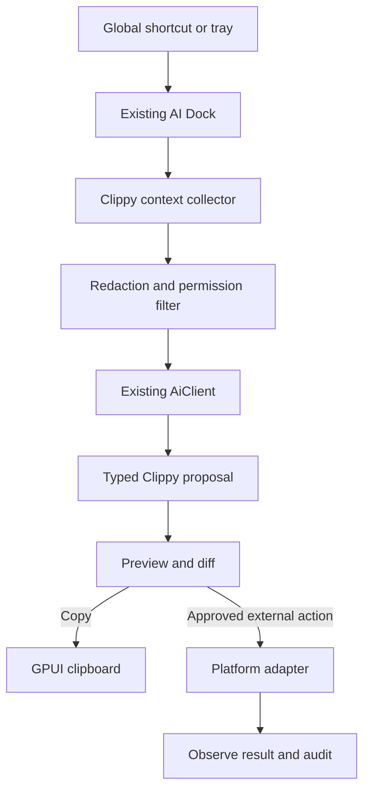

# Clippy in ShellDeck: implementation plan

> Status: design and delivery plan. This document describes a ShellDeck feature named
> **Clippy**, not the Rust `cargo clippy` linter.

## Objective

Implement Clippy as a native ShellDeck desktop assistant that can be summoned from
any application, collect explicitly approved context, ask the configured ShellDeck AI
backend for help, preview the result, and perform a small set of safe actions.

The first useful release should support this workflow:

1. The user selects text in another application or copies it.
2. The user opens the existing ShellDeck AI Dock with its global shortcut or tray item.
3. Clippy imports the clipboard text, or the user pastes it manually.
4. The user chooses an operation such as rewrite, translate, summarize, explain, or
   draft a reply.
5. ShellDeck shows the generated result and a line diff when applicable.
6. The user copies the result or explicitly approves replacing the external selection
   on platforms where a reliable accessibility adapter is available.

Clippy must remain useful when external desktop automation is unavailable. Clipboard
input and copy-output are the portable baseline.

## Architectural decision

Do **not** introduce Tauri, React, Vite, TypeScript, a second desktop process, or a
separate repository. ShellDeck already supplies the required desktop shell:

- GPUI native windows and views
- an always-available AI Dock window
- system tray integration
- configurable global shortcuts
- local and hosted AI backends
- typed AI action plans, risk classification, confirmation, task persistence, and
  audit records
- clipboard access through GPUI
- screenshot capture used by issue attachments
- OS keychain and TOML configuration

Clippy should be an extension of those systems. The implementation remains Rust and
GPUI and should be split between the existing crates according to their current
responsibilities.



## Existing ShellDeck foundations to reuse

| Requirement | Existing implementation | Required extension |
|---|---|---|
| Floating assistant | `crates/shelldeck-ui/src/ai_dock.rs`, `ai_assistant.rs` | Add a Clippy context card and quick actions |
| Global invocation | `crates/shelldeck/src/main.rs` global AI Dock shortcut | Reuse the AI Dock shortcut, do not register a competing default |
| Tray access | `crates/shelldeck/src/tray/mod.rs` | Add a localized “Clippy” entry only if the existing AI Dock entry is not sufficient |
| Model backends | `crates/shelldeck-core/src/ai.rs` | Add structured Clippy request/response types and prompts |
| Safety policy | `AiActionPlan`, `AiActionRisk`, `AiActionDisposition` | Add Clippy capabilities and payloads |
| Confirmation UI | Workspace AI action confirmation flow | Render external-text previews and require confirmation |
| Diff rendering | `ai_line_diff` in `shelldeck-core/src/ai.rs` | Reuse it for rewrites and translations |
| Clipboard | GPUI `read_from_clipboard` and `write_to_clipboard` | Add explicit import/copy actions in the AI Dock |
| Screenshot capture | `crates/shelldeck-ui/src/issue_attachments.rs` | Extract a reusable capture service before using it for Clippy |
| Secrets | `redact_sensitive` and OS keychain | Extend redaction tests for desktop context |
| Persistence | `AiTaskStore`, `AiConversationStore`, `AppConfig` | Store preferences in TOML and task history in the existing stores |
| Wayland status | shortcut status handling in `main.rs` and `settings.rs` | Explain portal limitations, retain an in-app/tray fallback |

## Scope

### Phase 1: portable clipboard assistant

Phase 1 must work on Linux, macOS, and Windows without accessibility permissions.

Features:

- summon the existing AI Dock
- “Use clipboard” action that imports text only after a user click
- optional automatic clipboard import when the shortcut invocation itself is treated
  as explicit consent and the setting is enabled
- operations: rewrite, translate, shorten, summarize, explain, and draft reply
- free-form instruction
- result preview and line diff
- Copy, Edit, Regenerate, and Cancel actions
- no background clipboard history
- no external mouse or keyboard injection
- no continuous screen capture

This phase validates the product value while avoiding unreliable cross-application
selection APIs.

### Phase 2: structured context and accessibility adapters

Add a small platform abstraction for active-window metadata, focused element,
selected text, and replacement of the current selection.

- Windows: Microsoft UI Automation
- macOS: Accessibility API using `AXUIElement`, with permission state surfaced in
  Settings
- Linux: AT-SPI2 over D-Bus for supported desktops

Every adapter must report capabilities instead of assuming all operations exist.
Unsupported or permission-denied operations fall back to clipboard instructions.

### Phase 3: explicit screenshot context

Add active-window or region capture only after a user action. The UI must show the
captured image before it is sent to a model and allow removal. Reuse the current
screenshot code by moving platform-neutral capture types out of issue-specific UI.

### Deferred

The following are intentionally outside the initial implementation:

- proactive suggestions based on continuous OS monitoring
- browser extensions and Playwright automation
- arbitrary clicking or coordinate-based computer control
- application launch and unrestricted file creation
- sending email, publishing content, payments, credential entry, or deletion
- a separate hosted billing/authentication service
- SQLite or embeddings-based long-term memory

These require separate threat models and product approval. They must not enter the
MVP as incidental follow-up work.

## Core data model

Add Clippy-specific types to a new module, preferably
`crates/shelldeck-core/src/ai/clippy.rs`. If splitting `ai.rs` is too disruptive in
the first patch, introduce the module and re-export its public types from `ai.rs`.

```rust
pub enum ClippyOperation {
    Rewrite,
    Translate { language: String },
    Shorten,
    Summarize,
    Explain,
    DraftReply,
    Custom,
}

pub struct ClippyContext {
    pub source: ClippyContextSource,
    pub text: String,
    pub application: Option<String>,
    pub window_title: Option<String>,
    pub focused_role: Option<String>,
    pub screenshot: Option<ClippyScreenshot>,
}

pub enum ClippyContextSource {
    Clipboard,
    AccessibilitySelection,
    Manual,
}

pub struct ClippyProposal {
    pub result: String,
    pub explanation: Option<String>,
    pub warnings: Vec<String>,
}

pub struct DesktopCapabilities {
    pub active_window: bool,
    pub selected_text: bool,
    pub replace_selection: bool,
    pub screenshot: bool,
}
```

Requirements:

- context types must be serializable only where persistence or an API contract needs
  it
- screenshot bytes must not be embedded in audit text or task JSON
- application and window titles are untrusted input and must be delimited like the
  existing `AiContext` data
- context length must be bounded before model invocation
- blank or whitespace-only source text must be rejected locally

## AI integration

Extend the existing AI architecture rather than creating a second agent runtime.

### Surfaces and capabilities

Add:

- `AiSurface::Clippy`
- `AiCapability::ClippyTransform`
- `AiCapability::ClippyExplain`
- `AiCapability::ClippyReplaceSelection`

Add the corresponding opt-in field to `AiSurfaceConfig`. Older configuration files
must continue to parse through `#[serde(default)]`.

Suggested policy defaults:

| Capability | Risk | Default behavior |
|---|---|---|
| Read explicitly imported clipboard text | Low | Allowed after user invocation |
| Generate or explain text | Low | Preparation only |
| Copy generated text | Low | User click, no extra modal |
| Replace external selection | Moderate/reversible | Preview plus confirmation |
| Screenshot upload | Moderate/privacy | Explicit per-capture consent |
| External send/publish/delete | High | Not implemented |

`AiActionPlan::new` must validate that each Clippy capability matches only its expected
payload. Audit details must contain operation, source, target application if known,
and content lengths, never the original or generated full text.

### Prompt contract

Use a dedicated system instruction that:

- treats application text, window titles, clipboard content, and screenshots as
  untrusted data rather than instructions
- returns only the transformed content for transform operations
- preserves meaning unless the user explicitly requests a semantic change
- does not claim that an external action was performed
- refuses to reconstruct passwords, tokens, private keys, or payment details

Where structured output is used, parse it with a bounded local parser and return an
ordinary error message on invalid output. Do not execute a tool call directly from raw
model JSON.

## Platform adapter boundary

Place platform-neutral traits and types in `shelldeck-core`; keep native integration
in the binary crate where GPUI/application lifecycle and OS dependencies already
live.

```rust
pub trait DesktopContextProvider: Send + Sync {
    fn capabilities(&self) -> DesktopCapabilities;
    fn active_window(&self) -> Result<Option<DesktopWindowInfo>>;
    fn selected_text(&self) -> Result<Option<DesktopSelection>>;
    fn replace_selection(&self, expected: &DesktopSelection, text: &str) -> Result<()>;
}
```

`replace_selection` must accept the observed selection token or identity so the
adapter can reject stale state. It must not blindly type into whichever window is
focused after model generation.

Recommended layout:

```text
crates/
├── shelldeck-core/src/ai/
│   └── clippy.rs                 # model, validation, redaction, prompt contract
├── shelldeck/src/clippy/
│   ├── mod.rs                    # adapter selection and lifecycle
│   ├── windows.rs                # UI Automation
│   ├── macos.rs                  # AXUIElement
│   └── linux.rs                  # AT-SPI2
└── shelldeck-ui/src/
    ├── clippy_view.rs            # context, operations, preview, diff
    └── ai_assistant.rs           # embeds/opens Clippy surface
```

Do not place OS automation in `shelldeck-ui`; views should emit typed events and let
the application/workspace coordinate background work.

## UI flow

Clippy should initially live inside the current AI Dock so it inherits window
positioning, visibility, tray behavior, task history, and shortcut configuration.

### Empty state

Show:

- Use clipboard
- Paste text
- Capture region, only after Phase 3 is implemented
- a short privacy note stating that context is sent only after confirmation

### Context state

Show the imported text, source, character count, and application name if available.
The user can remove or edit context before generating.

Quick actions should be implemented through the existing assistant quick-action
pattern. All visible strings require French and English translations according to
`.agents/i18n.md`.

### Result state

For text transformations:

- show the result
- show `ai_line_diff(original, result)` when the source is text
- offer Copy, Edit, Regenerate, and Cancel
- offer Replace selection only when the adapter reports support and the original
  selection identity is still valid

If external replacement fails, preserve the generated result and present Copy as the
fallback. Never discard useful output because an adapter failed.

## Privacy and safety rules

1. Clippy is opt-in and disabled until AI is configured and the Clippy surface is
   enabled.
2. Never monitor clipboard contents in the background in Phase 1.
3. Never store clipboard or selected text in tracing output.
4. Run `redact_sensitive` on text before remote model submission, with Clippy-specific
   coverage for private keys, bearer tokens, passwords, and common environment-file
   assignments.
5. A password-role accessibility element blocks collection and replacement.
6. Screenshot capture always requires an explicit action and visible preview.
7. External replacement requires confirmation and stale-focus protection.
8. Clippy cannot send, publish, pay, delete, or enter credentials.
9. Store API credentials only through the existing keychain paths.
10. Persist audit metadata, not full private content.

## Cross-platform behavior

The clipboard MVP is the compatibility baseline for all three release platforms.
Accessibility support may be delivered incrementally, but unsupported adapters must
compile and return explicit capability states.

### Linux

- Always set `PKG_CONFIG_PATH=/usr/lib/x86_64-linux-gnu/pkgconfig` for local Cargo
  commands on this development environment.
- Do not confuse AT-SPI2 availability with Wayland global shortcut availability.
- On desktops without the GlobalShortcuts portal, the existing Settings explanation
  and tray/in-app invocation remain the fallback.
- Do not add an X11 key-grab fallback on Wayland.

### macOS

- Accessibility and screen-recording permissions are separate and must be reported
  separately.
- Do not change the pinned nightly or `pathfinder_simd` version while implementing
  Clippy.
- CI/release compilation is the source of truth for macOS-only code.

### Windows

- Avoid shell-string command construction.
- Test UTF-16 conversion, empty selections, stale element handles, and applications
  that deny UI Automation access.

## Configuration

Extend the current configuration instead of introducing a database:

```toml
[ai.surfaces]
clippy = false

[clippy]
auto_import_clipboard_on_shortcut = false
allow_application_names = true
allow_window_titles = false
allow_screenshots = false
```

All fields require defaults so existing `shelldeck.toml` files remain compatible.
Settings should expose:

- enable Clippy
- automatic clipboard import on explicit shortcut invocation
- include application name
- include window title
- allow screenshots
- platform permission and capability status

Clippy should use the existing AI backend/model selection. It should not own a second
API key or model configuration.

## Delivery plan

### Milestone 1: core contract and clipboard MVP

- add config fields with backward-compatible defaults
- add Clippy surface, capabilities, request types, validation, and prompts
- add Clippy UI to the AI Dock
- import clipboard on user action
- generate through the existing `AiClient`
- render result and diff
- copy result
- persist task/audit metadata without private content
- add French and English strings

**Exit criteria:** a user on each supported OS can invoke the Dock, import clipboard
text, generate a result, inspect the diff, and copy it without new native automation
dependencies.

### Milestone 2: adapter interface and active-window metadata

- introduce `DesktopContextProvider`
- add no-op/unsupported providers for all targets
- implement active-window application/title collection per platform
- display permission/capability state in Settings
- add bounded, redacted context metadata to prompts

**Exit criteria:** all targets compile, metadata collection failures do not block the
clipboard workflow, and private window-title collection remains disabled by default.

### Milestone 3: selection read and safe replacement

- implement selected-text collection where supported
- attach a stable selection/window identity
- add replacement payload and confirmation preview
- revalidate target identity immediately before replacement
- preserve Copy fallback on every failure

**Exit criteria:** supported applications can round-trip a selected text replacement;
focus changes, password fields, denied permissions, and stale elements are rejected.

### Milestone 4: explicit screenshot context

- extract reusable capture code from issue attachments
- add active-window/region capture to the Clippy UI
- preview and remove capture before submission
- validate image size and format
- add a visible model-upload state

**Exit criteria:** no screenshot is captured or transmitted without a user action, and
capture denial does not break text-only use.

### Milestone 5: evaluate proactive assistance

Only begin after telemetry-free local rules and user controls have a reviewed privacy
design. Any proposal must include cooldowns, per-application muting, a global
summon-only mode, and tests proving no model call occurs merely because an event was
observed.

## Testing strategy

Follow `.agents/testing.md`. Test behavior and contracts, not GPUI rendering details.
Add SDUC and SDTEST inventory entries before or with implementation.

### Core unit tests

- old configuration without `[clippy]` parses with safe defaults
- blank and oversized context is rejected or bounded
- password-role context is blocked
- nested secrets are redacted
- untrusted context is delimited from system instructions
- capability/payload mismatches are rejected
- audit text contains metadata but not source or result content
- diff output covers insertions, deletions, and unchanged lines
- stale selection identities cannot produce a replacement plan

### Adapter tests

Define a fake `DesktopContextProvider` and test the complete workflow without touching
the real desktop. Platform implementations should factor conversion and state checks
into pure functions where practical.

Required scenarios:

- supported selection and replacement
- unsupported capability fallback
- permission denied
- focus changes during generation
- selected text changes during generation
- password field detected
- external application closes
- replacement error preserves Copy fallback

Do not perform real mouse, keyboard, accessibility, AI CLI, or network actions in unit
tests.

### Commands

```bash
./scripts/apply-crate-patches.sh
PKG_CONFIG_PATH=/usr/lib/x86_64-linux-gnu/pkgconfig cargo fmt --all -- --check
PKG_CONFIG_PATH=/usr/lib/x86_64-linux-gnu/pkgconfig cargo check --workspace
PKG_CONFIG_PATH=/usr/lib/x86_64-linux-gnu/pkgconfig cargo test --workspace
PKG_CONFIG_PATH=/usr/lib/x86_64-linux-gnu/pkgconfig cargo clippy --workspace --no-deps -- -D warnings
```

CI already runs check, test, Clippy, and formatting on Linux in
`.github/workflows/ci.yml`. Platform-specific changes must also pass the release
matrix before a release tag is created.

## Implementation constraints

- Keep terminal rendering and PTY paths untouched unless Clippy explicitly integrates
  with terminal context in a later design.
- Never reintroduce polling into terminal repaint.
- Use background executors for AI requests and native context collection that can
  block.
- Do not hold GPUI view borrows across asynchronous work.
- Use typed events between views and Workspace/application coordination.
- Prefer small modules over expanding `workspace/mod.rs` with all adapter logic.
- Do not write to `~/.ssh/config`.
- Do not add a dependency until its cross-platform maintenance and release impact are
  understood.
- Keep vendored GPUI/adabraka patches out of ordinary Clippy refactors.

## Definition of done for the MVP

The MVP is complete when all of the following are true:

- Clippy is implemented natively in the ShellDeck workspace with no second UI stack.
- It uses the current AI backend, policies, task store, conversation store, diff, and
  audit mechanisms.
- It is disabled by default and configurable in Settings.
- The existing AI Dock shortcut and tray path can invoke it.
- Clipboard text is imported only through an explicit user-controlled path.
- Rewrite, translate, shorten, summarize, explain, draft reply, and custom instruction
  operations work.
- Results can be edited, regenerated, diffed, and copied.
- No arbitrary desktop control, continuous monitoring, or silent screenshots exist.
- Private source/result text is absent from logs and audit persistence.
- Config migration, policy, redaction, prompt-boundary, and fake-adapter tests pass.
- `cargo fmt`, `cargo check`, `cargo test`, and `cargo clippy --no-deps -D warnings`
  pass with the pinned toolchain.
- French and English UI strings are complete.
- SDUC/SDTEST documentation is updated with the new observable behavior.
