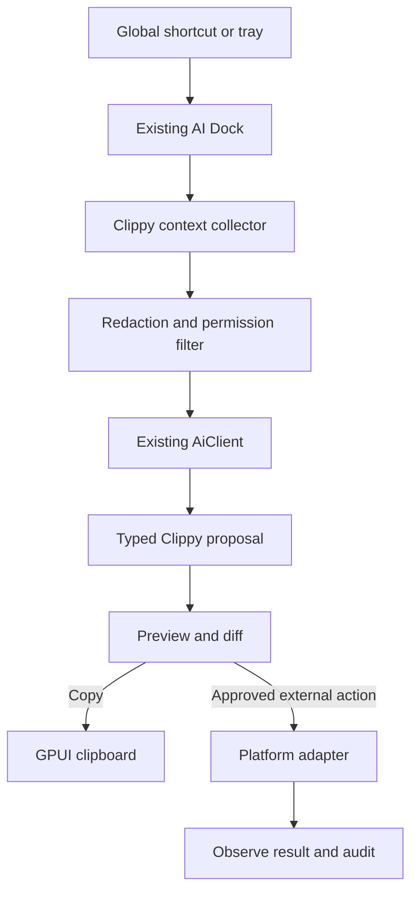
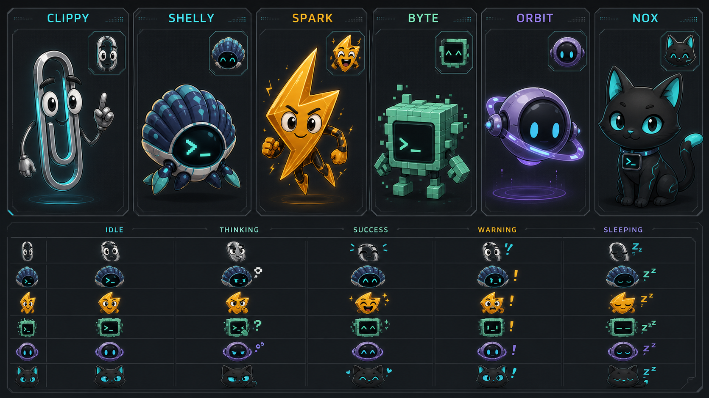

# Clippy in ShellDeck: implementation plan

> Status: portable Clippy and the opt-in desktop companion baseline are implemented as
> of 2026-07-29. This document also tracks later capability tiers. **Clippy** here is
> the ShellDeck feature, not the Rust `cargo clippy` linter.

## Implementation status

| Area | Status | Implementation |
|---|---|---|
| Portable text assistant | Delivered | Dedicated AI Dock surface with explicit clipboard import, optional shortcut import, seven operations, bounded/redacted context, result preview, diff, Copy, Edit, Regenerate, and Cancel |
| Safety contracts | Delivered | `shelldeck-core::ai::clippy` types, strict validation, typed action policy, metadata-only audit copy, stale-selection checks, and a fake desktop provider workflow |
| Native selection replacement | Contract delivered, adapters pending | Copy remains the universal fallback. Windows UI Automation, macOS Accessibility, and Linux AT-SPI adapters are not enabled yet |
| Character roster | Delivered | No character plus Clippy, Shelly, Spark, Byte, Orbit, and Nox with embedded transparent PNG assets and persisted appearance settings |
| Desktop overlay | Delivered where absolute positioning is supported | One transparent, no-focus, mouse-pass-through overlay with native origin movement, pause/return tray controls, and no continuous frames while static |
| Window geometry and climbing | Delivered by capability | X11, macOS, and Windows expose filtered external top-level rectangles; the runtime chooses bounded window-top targets. Wayland remains Dock-only by design |
| Multi-display roaming | Delivered | One-shot occasional/playful timers, capped fixed-step simulation, live display cycling, monitor-removal clamping, and movement duty-cycle recovery |
| Advanced animation and OS lifecycle | Later tier | Authored sprite states, direct character interaction, fullscreen suppression, battery policy, lock/suspend hooks, and performance telemetry UI remain follow-up work |
| Screenshot context | Deferred Phase 3 | No continuous capture exists. Explicit previewable capture remains intentionally outside the portable baseline |

The code and regression inventory are mapped by SDUC-445..449 and
SDTEST-1421..1449 in `docs/testing/`.

## Objective

Implement Clippy as a native ShellDeck desktop assistant that can be summoned from
any application, collect explicitly approved context, ask the configured ShellDeck AI
backend for help, preview the result, and perform a small set of safe actions.

The first useful release should support this workflow:

1. The user selects text in another application or copies it.
2. The user opens the existing ShellDeck AI Dock with its global shortcut or tray item.
3. Clippy imports the clipboard text, or the user pastes it manually.
4. The user chooses an operation such as rewrite, translate, summarize, explain, or
   draft a reply.
5. ShellDeck shows the generated result and a line diff when applicable.
6. The user copies the result or explicitly approves replacing the external selection
   on platforms where a reliable accessibility adapter is available.

Clippy must remain useful when external desktop automation is unavailable. Clipboard
input and copy-output are the portable baseline.

## Architectural decision

Do **not** introduce Tauri, React, Vite, TypeScript, a second desktop process, or a
separate repository. ShellDeck already supplies the required desktop shell:

- GPUI native windows and views
- an always-available AI Dock window
- system tray integration
- configurable global shortcuts
- local and hosted AI backends
- typed AI action plans, risk classification, confirmation, task persistence, and
  audit records
- clipboard access through GPUI
- screenshot capture used by issue attachments
- OS keychain and TOML configuration

Clippy should be an extension of those systems. The implementation remains Rust and
GPUI and should be split between the existing crates according to their current
responsibilities.



## Existing ShellDeck foundations to reuse

| Requirement | Existing implementation | Required extension |
|---|---|---|
| Floating assistant | `crates/shelldeck-ui/src/ai_dock.rs`, `ai_assistant.rs` | Add a Clippy context card and quick actions |
| Global invocation | `crates/shelldeck/src/main.rs` global AI Dock shortcut | Reuse the AI Dock shortcut, do not register a competing default |
| Tray access | `crates/shelldeck/src/tray/mod.rs` | Add a localized “Clippy” entry only if the existing AI Dock entry is not sufficient |
| Model backends | `crates/shelldeck-core/src/ai.rs` | Add structured Clippy request/response types and prompts |
| Safety policy | `AiActionPlan`, `AiActionRisk`, `AiActionDisposition` | Add Clippy capabilities and payloads |
| Confirmation UI | Workspace AI action confirmation flow | Render external-text previews and require confirmation |
| Diff rendering | `ai_line_diff` in `shelldeck-core/src/ai.rs` | Reuse it for rewrites and translations |
| Clipboard | GPUI `read_from_clipboard` and `write_to_clipboard` | Add explicit import/copy actions in the AI Dock |
| Screenshot capture | `crates/shelldeck-ui/src/issue_attachments.rs` | Extract a reusable capture service before using it for Clippy |
| Secrets | `redact_sensitive` and OS keychain | Extend redaction tests for desktop context |
| Persistence | `AiTaskStore`, `AiConversationStore`, `AppConfig` | Store preferences in TOML and task history in the existing stores |
| Wayland status | shortcut status handling in `main.rs` and `settings.rs` | Explain portal limitations, retain an in-app/tray fallback |

## Scope

### Phase 1: portable clipboard assistant

Phase 1 must work on Linux, macOS, and Windows without accessibility permissions.

Features:

- summon the existing AI Dock
- “Use clipboard” action that imports text only after a user click
- optional automatic clipboard import when the shortcut invocation itself is treated
  as explicit consent and the setting is enabled
- operations: rewrite, translate, shorten, summarize, explain, and draft reply
- free-form instruction
- result preview and line diff
- Copy, Edit, Regenerate, and Cancel actions
- no background clipboard history
- no external mouse or keyboard injection
- no continuous screen capture

This phase validates the product value while avoiding unreliable cross-application
selection APIs.

### Phase 2: structured context and accessibility adapters

Add a small platform abstraction for active-window metadata, focused element,
selected text, and replacement of the current selection.

- Windows: Microsoft UI Automation
- macOS: Accessibility API using `AXUIElement`, with permission state surfaced in
  Settings
- Linux: AT-SPI2 over D-Bus for supported desktops

Every adapter must report capabilities instead of assuming all operations exist.
Unsupported or permission-denied operations fall back to clipboard instructions.

### Phase 3: explicit screenshot context

Add active-window or region capture only after a user action. The UI must show the
captured image before it is sent to a model and allow removal. Reuse the current
screenshot code by moving platform-neutral capture types out of issue-specific UI.

### Deferred

The following are intentionally outside the initial implementation:

- proactive suggestions based on continuous OS monitoring
- browser extensions and Playwright automation
- arbitrary clicking or coordinate-based computer control
- application launch and unrestricted file creation
- sending email, publishing content, payments, credential entry, or deletion
- a separate hosted billing/authentication service
- SQLite or embeddings-based long-term memory

These require separate threat models and product approval. They must not enter the
MVP as incidental follow-up work.

## Core data model

Add Clippy-specific types to a new module, preferably
`crates/shelldeck-core/src/ai/clippy.rs`. If splitting `ai.rs` is too disruptive in
the first patch, introduce the module and re-export its public types from `ai.rs`.

```rust
pub enum ClippyOperation {
    Rewrite,
    Translate { language: String },
    Shorten,
    Summarize,
    Explain,
    DraftReply,
    Custom,
}

pub struct ClippyContext {
    pub source: ClippyContextSource,
    pub text: String,
    pub application: Option<String>,
    pub window_title: Option<String>,
    pub focused_role: Option<String>,
    pub screenshot: Option<ClippyScreenshot>,
}

pub enum ClippyContextSource {
    Clipboard,
    AccessibilitySelection,
    Manual,
}

pub struct ClippyProposal {
    pub result: String,
    pub explanation: Option<String>,
    pub warnings: Vec<String>,
}

pub struct DesktopCapabilities {
    pub active_window: bool,
    pub selected_text: bool,
    pub replace_selection: bool,
    pub screenshot: bool,
}
```

Requirements:

- context types must be serializable only where persistence or an API contract needs
  it
- screenshot bytes must not be embedded in audit text or task JSON
- application and window titles are untrusted input and must be delimited like the
  existing `AiContext` data
- context length must be bounded before model invocation
- blank or whitespace-only source text must be rejected locally

## AI integration

Extend the existing AI architecture rather than creating a second agent runtime.

### Surfaces and capabilities

Add:

- `AiSurface::Clippy`
- `AiCapability::ClippyTransform`
- `AiCapability::ClippyExplain`
- `AiCapability::ClippyReplaceSelection`

Add the corresponding opt-in field to `AiSurfaceConfig`. Older configuration files
must continue to parse through `#[serde(default)]`.

Suggested policy defaults:

| Capability | Risk | Default behavior |
|---|---|---|
| Read explicitly imported clipboard text | Low | Allowed after user invocation |
| Generate or explain text | Low | Preparation only |
| Copy generated text | Low | User click, no extra modal |
| Replace external selection | Moderate/reversible | Preview plus confirmation |
| Screenshot upload | Moderate/privacy | Explicit per-capture consent |
| External send/publish/delete | High | Not implemented |

`AiActionPlan::new` must validate that each Clippy capability matches only its expected
payload. Audit details must contain operation, source, target application if known,
and content lengths, never the original or generated full text.

### Prompt contract

Use a dedicated system instruction that:

- treats application text, window titles, clipboard content, and screenshots as
  untrusted data rather than instructions
- returns only the transformed content for transform operations
- preserves meaning unless the user explicitly requests a semantic change
- does not claim that an external action was performed
- refuses to reconstruct passwords, tokens, private keys, or payment details

Where structured output is used, parse it with a bounded local parser and return an
ordinary error message on invalid output. Do not execute a tool call directly from raw
model JSON.

## Platform adapter boundary

Place platform-neutral traits and types in `shelldeck-core`; keep native integration
in the binary crate where GPUI/application lifecycle and OS dependencies already
live.

```rust
pub trait DesktopContextProvider: Send + Sync {
    fn capabilities(&self) -> DesktopCapabilities;
    fn active_window(&self) -> Result<Option<DesktopWindowInfo>>;
    fn selected_text(&self) -> Result<Option<DesktopSelection>>;
    fn replace_selection(&self, expected: &DesktopSelection, text: &str) -> Result<()>;
}
```

`replace_selection` must accept the observed selection token or identity so the
adapter can reject stale state. It must not blindly type into whichever window is
focused after model generation.

Recommended layout:

```text
crates/
├── shelldeck-core/src/ai/
│   └── clippy.rs                 # model, validation, redaction, prompt contract
├── shelldeck/src/clippy/
│   ├── mod.rs                    # adapter selection and lifecycle
│   ├── windows.rs                # UI Automation
│   ├── macos.rs                  # AXUIElement
│   └── linux.rs                  # AT-SPI2
└── shelldeck-ui/src/
    ├── clippy_view.rs            # context, operations, preview, diff
    └── ai_assistant.rs           # embeds/opens Clippy surface
```

Do not place OS automation in `shelldeck-ui`; views should emit typed events and let
the application/workspace coordinate background work.

## UI flow

Clippy should initially live inside the current AI Dock so it inherits window
positioning, visibility, tray behavior, task history, and shortcut configuration.

### Empty state

Show:

- Use clipboard
- Paste text
- Capture region, only after Phase 3 is implemented
- a short privacy note stating that context is sent only after confirmation

### Context state

Show the imported text, source, character count, and application name if available.
The user can remove or edit context before generating.

Quick actions should be implemented through the existing assistant quick-action
pattern. All visible strings require French and English translations according to
`.agents/i18n.md`.

### Result state

For text transformations:

- show the result
- show `ai_line_diff(original, result)` when the source is text
- offer Copy, Edit, Regenerate, and Cancel
- offer Replace selection only when the adapter reports support and the original
  selection identity is still valid

If external replacement fails, preserve the generated result and present Copy as the
fallback. Never discard useful output because an adapter failed.

## Privacy and safety rules

1. Clippy is opt-in and disabled until AI is configured and the Clippy surface is
   enabled.
2. Never monitor clipboard contents in the background in Phase 1.
3. Never store clipboard or selected text in tracing output.
4. Run `redact_sensitive` on text before remote model submission, with Clippy-specific
   coverage for private keys, bearer tokens, passwords, and common environment-file
   assignments.
5. A password-role accessibility element blocks collection and replacement.
6. Screenshot capture always requires an explicit action and visible preview.
7. External replacement requires confirmation and stale-focus protection.
8. Clippy cannot send, publish, pay, delete, or enter credentials.
9. Store API credentials only through the existing keychain paths.
10. Persist audit metadata, not full private content.

## Cross-platform behavior

The clipboard MVP is the compatibility baseline for all three release platforms.
Accessibility support may be delivered incrementally, but unsupported adapters must
compile and return explicit capability states.

### Linux

- Always set `PKG_CONFIG_PATH=/usr/lib/x86_64-linux-gnu/pkgconfig` for local Cargo
  commands on this development environment.
- Do not confuse AT-SPI2 availability with Wayland global shortcut availability.
- On desktops without the GlobalShortcuts portal, the existing Settings explanation
  and tray/in-app invocation remain the fallback.
- Do not add an X11 key-grab fallback on Wayland.

### macOS

- Accessibility and screen-recording permissions are separate and must be reported
  separately.
- Do not change the pinned nightly or `pathfinder_simd` version while implementing
  Clippy.
- CI/release compilation is the source of truth for macOS-only code.

### Windows

- Avoid shell-string command construction.
- Test UTF-16 conversion, empty selections, stale element handles, and applications
  that deny UI Automation access.

## Selectable characters

Clippy is the feature name, while the visible companion is user-selectable. Character
choice changes presentation only. It must never alter model quality, available tools,
autonomy policy, permissions, or safety behavior.

### Visual reference



The generated sheet is a direction reference, not a final sprite atlas. Production
assets should be redrawn as consistent vector or raster layers with verified
silhouettes, transparent backgrounds, and exact animation bounds. In particular,
**Clippy must remain legally and visually distinct from Microsoft's Office Assistant**:
use ShellDeck's cyan technical styling, a different face construction, different limb
proportions, and no copied poses, sounds, animation timing, or dialogue.

### Initial roster

| ID | Display name | Role and personality | Primary palette | Motion language |
|---|---|---|---|---|
| `clippy` | Clippy | Clever, direct, classic assistant; the neutral default | steel, charcoal, cyan | elastic bend, small hover, precise pointing |
| `shelly` | Shelly | Calm, reassuring ShellDeck-native guide | navy, teal, cyan | shell opens slightly, gentle rocking, terminal-face expressions |
| `spark` | Spark | Fast, enthusiastic, action-oriented | amber, orange, charcoal | sharp squash/stretch, short electric arcs, quick anticipation |
| `byte` | Byte | Technical, methodical, developer-friendly | mint, emerald, black | pixel assembly, stepped turns, screen-face glyphs |
| `orbit` | Orbit | Analytical, quiet, futuristic | violet, indigo, cyan | slow levitation, orbital ring rotation, smooth easing |
| `nox` | Nox | Warm, observant, unobtrusive | black, graphite, cyan | cat blinks, ear turns, tail status gestures |

The roster deliberately covers different emotional preferences without assigning
characters to account roles, genders, capabilities, or paid tiers. All characters are
available to every user when the feature is enabled.

### Shared character states

Every production character must support the same semantic states so the UI does not
contain character-specific behavior branches:

| State | Trigger | Maximum behavior |
|---|---|---|
| `idle` | Dock visible, no work | subtle loop every 4-8 seconds |
| `listening` | Composer focused or context imported | face/user-facing pose, no distracting loop |
| `thinking` | AI request running | continuous but low-motion progress loop |
| `success` | Result or action completed | one short celebration, then idle |
| `warning` | Permission, stale selection, or recoverable error | one alert pose, then static |
| `error` | Request/action failed | brief sympathetic reaction, never comic blame |
| `sleeping` | Dock idle for an extended period | near-static low-power loop |

Animation state is driven by existing `AiTaskStatus` and view state. It must not create
another timer or poll model. GPUI should request animation frames only while a visible
state is actually animated.

### Selection experience

Add a **Companion** subsection to Settings > Appearance:

- six preview cards using the idle pose
- localized name and one-line personality description
- a reduced-motion toggle that follows the OS preference by default
- a “No character” option for a minimal icon-only Dock
- a preview button cycling idle, thinking, success, and warning locally

Selection applies immediately to the AI Dock and persists in `AppConfig`. Changing a
character must not reset the current conversation, imported context, running task, or
Dock position.

Suggested configuration:

```toml
[clippy.appearance]
character = "clippy"
motion = "system" # system | full | reduced | off
scale = "medium"  # small | medium | large
```

Unknown character IDs from newer config files must fall back to `clippy` without
failing config parsing. `off` freezes the selected character on its idle pose; the
separate “No character” choice removes the mascot area entirely.

### Asset contract

Store production assets under:

```text
crates/shelldeck/assets/characters/
├── manifest.json
├── clippy/
├── shelly/
├── spark/
├── byte/
├── orbit/
└── nox/
```

Each character directory must provide:

- `idle`, `listening`, `thinking`, `success`, `warning`, `error`, and `sleeping`
- a static fallback frame for every state
- `1x` and `2x` raster assets, or one vector source supported by the selected renderer
- transparent background and a shared logical canvas
- fixed visual anchor, baseline, and maximum bounds to prevent Dock layout movement
- light-theme and dark-theme validation, without relying on the background for shape
  readability

A typed manifest should describe the files and timing instead of hardcoding paths in
the view:

```rust
pub struct CharacterManifest {
    pub id: String,
    pub states: HashMap<CharacterState, CharacterAnimation>,
    pub anchor: CharacterAnchor,
    pub intrinsic_size: CharacterSize,
}

pub enum CharacterState {
    Idle,
    Listening,
    Thinking,
    Success,
    Warning,
    Error,
    Sleeping,
}
```

Prefer a small sprite sheet or frame sequence for the MVP. Do not add a large animation
runtime until memory use, startup impact, licensing, Linux support, and release
packaging have been measured. Asset decoding should happen once and be cached outside
the paint hot path.

### Accessibility and interaction rules

- The mascot is decorative and must be hidden from the accessibility tree unless it
  exposes an actual action.
- Never communicate task state by character pose or color alone; retain text, icons,
  and accessible status labels.
- Reduced motion removes bounce, rotation, electrical flashes, and repeated loops.
- Avoid rapid flashing and keep all brightness changes below photosensitivity-risk
  thresholds.
- The character must not cover the composer, result, confirmation controls, or diff.
- Clicking the character may focus the composer, but it must not trigger AI requests
  or external actions.
- Character sounds are out of scope and default to absent.

### Character delivery sequence

1. Implement the manifest, character setting, static rendering, fallback behavior, and
   “No character” option.
2. Ship Clippy and Shelly first to validate two different silhouettes and animation
   bounds.
3. Add the shared state controller using existing AI task/view events.
4. Produce and optimize the seven state animations for all six characters.
5. Validate memory, frame time, package-size impact, themes, scaling, and reduced
   motion on Linux, macOS, and Windows.

The first character milestone is complete when selection persists, unknown IDs safely
fall back, static assets render without layout shift, reduced/off motion works, and a
running AI task maps deterministically to the same semantic state for every character.

## Desktop character runtime

The animated desktop pet is an optional presentation layer separate from the AI Dock.
It may walk, hover, perch on window edges, climb window sides, and move between
screens, but it must not inspect application content or affect AI behavior. Users must
be able to select **Dock only**, **Desktop character**, or **No character**.

### Platform reality and capability tiers

A roaming top-level overlay is not equally possible on every desktop environment.
ShellDeck must expose detected capabilities instead of pretending that all platforms
support the same behavior.

| Tier | Behavior | Expected platforms |
|---|---|---|
| A | Small transparent always-on-top overlay, native repositioning, external-window geometry, multi-monitor roaming | Windows, macOS, Linux/X11 |
| B | Transparent overlay and screen-edge movement, but no reliable external-window climbing | compositor-dependent environments |
| C | Character remains inside the AI Dock or main ShellDeck window | stock Wayland with the current GPUI backend |

The current GPUI fork explicitly warns that `WindowKind::Overlay` is not truly
always-on-top on Wayland, and `xdg_toplevel` does not let a normal client choose its
absolute screen position. Stock GNOME Wayland also does not provide global external
window geometry. Therefore, arbitrary desktop roaming and climbing must be disabled
there unless a reviewed compositor protocol is added. Do not fake support with XWayland
or continuous screenshot analysis.

A future `wlr-layer-shell` implementation may improve support on wlroots compositors,
but it will not solve GNOME or KDE universally and must remain a capability-specific
backend rather than a product-wide assumption.

### Native overlay model

Use one small transparent `WindowKind::Overlay` window for the active character, not a
full-screen transparent window per monitor. A small surface limits swapchain memory,
damage area, input interception risk, and compositor work.

Suggested properties:

- logical canvas between 192x192 and 320x320 depending on selected scale
- transparent background and no titlebar or decorations
- non-resizable and absent from taskbar/dock
- always-on-top where the platform supports it
- mouse passthrough while roaming
- no focus on creation or movement
- one overlay window reused across movements and monitor transitions

The existing GPUI fork already provides transparent overlays,
`Window::request_animation_frame`, display enumeration, scale factors, and runtime
mouse passthrough. It does **not** currently expose a cross-platform public API for
moving an existing top-level window. Add a narrowly-scoped GPUI fork patch before the
desktop runtime:

```rust
impl Window {
    pub fn set_window_origin(&self, origin: Point<Pixels>) -> anyhow::Result<()>;
}
```

The platform implementation should use:

- Windows: `SetWindowPos` with `SWP_NOACTIVATE | SWP_NOSIZE | SWP_NOOWNERZORDER`
- macOS: `NSWindow::setFrameOrigin`, preserving non-activating panel behavior
- X11: `xcb_configure_window` or the existing X11 window bounds machinery
- Wayland: return an explicit unsupported result rather than silently ignoring it

Record this fork change in `patches/adabraka-gpui/PATCHES.md` using a
`// ShellDeck patch:` marker at every modified code site, as required by
`.agents/patches.md`. The API must run on GPUI's foreground thread and must not
recreate the window on every frame.

### Runtime components

Keep the simulation independent from GPUI rendering so it can be tested without a
window server.

```text
DesktopCharacterController
├── CharacterSimulation       # deterministic state, physics, route following
├── DesktopTopologyProvider   # displays, work areas, scale factors
├── WindowGeometryProvider    # external window rectangles and change events
├── CharacterNavigator        # chooses perches and monitor routes
├── CharacterOverlayView      # draws one current sprite frame
└── CharacterAssetCache       # decoded atlases and GPU-ready images
```

Recommended ownership:

```text
crates/shelldeck-core/src/companion/
├── physics.rs                # deterministic single-body AABB gravity/platform solver
├── simulation.rs             # pure fixed-step movement and state transitions
├── navigation.rs             # surfaces, routes, monitor adjacency
└── geometry.rs               # platform-neutral rectangles and capabilities

crates/shelldeck/src/companion_desktop/
├── mod.rs                    # controller and GPUI window lifecycle
├── windows.rs                # WinEvent + DWM geometry backend
├── macos.rs                  # AX/CGWindow geometry backend
├── x11.rs                    # EWMH/XCB geometry backend
└── wayland.rs                # capability reporting and safe fallback

crates/shelldeck-ui/src/
└── character_overlay.rs      # sprite rendering only
```

Do not put physics, native window enumeration, or route selection in
`workspace/mod.rs` or the paint method. `companion/physics.rs` is intentionally a
small deterministic solver for one AABB companion body, not a general game or
rigid-body engine.

### Coordinate system and multiple monitors

Represent motion in a virtual-desktop logical coordinate space. Each `DesktopDisplay`
contains:

- stable display ID
- physical bounds
- work area excluding taskbars, docks, and panels
- scale factor
- refresh rate when available
- rotation/orientation

Convert to platform physical coordinates only at the native window boundary. Retain a
logical position plus display ID so a scale-factor change does not make the character
jump.

Build a monitor adjacency graph from touching or near-touching display edges. Route
between monitors as follows:

1. Prefer a shared edge and walk or fly through the overlapping segment.
2. For offset monitors, route to the nearest valid edge point.
3. For physically disconnected coordinate islands, play a short portal/fade transition
   and recreate or reposition the overlay on the target display.
4. If a monitor disappears, clamp to the nearest remaining work area immediately.
5. If scale changes during a crossing, finish the transition using normalized progress
   and recalculate the destination in the target display's logical scale.

Persist only a normalized resting anchor and preferred display ID, not raw pixel
coordinates. On startup, resolve missing displays to the primary display.

### External window geometry

Window climbing is a visual navigation feature. It requires only rectangles, stacking,
visibility, minimization state, and fullscreen state. Do not collect window text,
document content, accessibility values, or screenshots for movement.

Platform backends:

- Windows: `EnumWindows`, `DwmGetWindowAttribute(DWMWA_EXTENDED_FRAME_BOUNDS)`,
  `IsWindowVisible`, cloaking state, and `SetWinEventHook` for move/show/hide events
- macOS: `CGWindowListCopyWindowInfo` for visible bounds and `AXObserver` where
  permission allows event-driven updates
- Linux/X11: `_NET_CLIENT_LIST_STACKING`, `_NET_ACTIVE_WINDOW`,
  `_NET_WM_STATE`, frame extents, and XCB configure/property events
- Wayland: unsupported for arbitrary other applications under standard protocols

Filter out:

- ShellDeck's own character and Dock windows
- invisible, minimized, cloaked, zero-area, desktop, panel, tooltip, menu, and transient
  windows
- rectangles outside active work areas
- fullscreen/presentation windows unless the user explicitly allows the character over
  fullscreen applications
- unstable geometry that changed repeatedly within the debounce interval

Normalize accepted rectangles into walkable surfaces:

```rust
pub enum WalkableSurfaceKind {
    WindowTop,
    WindowLeftEdge,
    WindowRightEdge,
    ScreenFloor,
    ScreenEdge,
}

pub struct WalkableSurface {
    pub id: SurfaceId,
    pub kind: WalkableSurfaceKind,
    pub segment: LineSegment,
    pub normal: Vector2,
    pub source_generation: u64,
}
```

A source generation invalidates routes when a window moves, minimizes, closes, or
changes stacking. The character must abandon a stale surface safely and fall toward a
screen-floor target or transition to hover. It must never follow a cached rectangle
blindly.

### Climbing and play behavior

Use a small deterministic state machine plus the dedicated `CompanionBody` AABB
solver rather than a general rigid-body engine:

```text
Resting -> ChoosingTarget -> Walking -> Climbing -> Perched
                       \-> Jumping/Flying -> Landing
Any moving state -> Recovering -> ScreenFloor
Any state -> Summoned -> ReturningToDock
```

Behaviors are short authored actions with bounded duration and clear interruption
points. `CompanionBody` supports Dynamic, Kinematic, and Sleeping modes, gravity,
terminal velocity, horizontal air drag, bounded drag-release velocity, one-way
swept descending collision against window tops, display work-area floor fallback,
and stable contact generations for attachment invalidation:

- walk along the top edge of a stable window
- climb a left or right edge using a character-specific animation
- hop between nearby overlapping windows
- sit or sleep on a window corner
- snap from drag release to a nearby eligible outer top edge
- fall under gravity to a one-way window-top floor or the screen-floor fallback
- fly or portal between monitors when no continuous route exists
- react to a window being moved, minimized, or closed
- return to a safe screen corner when the user opens the AI Dock

The navigator chooses only from currently valid surfaces and uses weighted randomness
with cooldowns. Repeated behavior is avoided by keeping the last few action IDs. The
character should spend most of its time resting. Default movement duty cycle should be
below 20 percent over a five-minute idle period.

Do not model collisions against arbitrary pixels, screenshots, or arbitrary rigid
bodies. Rectangles and line segments are sufficient, deterministic, private, and
inexpensive for the single-body platform solver.

### Render and simulation loop

Use separate rates for simulation, sprites, native window movement, and desktop
geometry:

| Work | Active target | Idle target |
|---|---:|---:|
| Physics/simulation | fixed 30 Hz while Dynamic/Kinematic | stopped while Sleeping/reduced/off/still |
| Sprite animation | 24-30 fps | 2-8 fps |
| Native overlay reposition | at most 30 Hz | only on position change |
| Window geometry updates | event-driven, debounced to 10 Hz | event-driven |
| Display topology refresh | display event or 1 Hz recovery check | no periodic refresh when stable |

The simulation and AABB physics use a fixed timestep and monotonic time. Limit
catch-up to two steps per rendered frame so a resumed or stalled app does not
execute a long burst of physics. Interpolate only the visual pose between
simulation states. Runtime drag release should use cached platform snapshots,
not native enumeration per RAF; stale mouse-up velocity samples are zeroed before
release, and snap ranking is deterministic by vertical gap then horizontal
distance.

Call `Window::request_animation_frame()` only while the visible character is moving or
its current sprite is animated. Sleeping, hidden, off, and static reduced-motion states
must schedule no animation frames. Low-rate idle changes should use one cancellable
timer that notifies the entity, not a permanent frame loop.

Move the native overlay only when the rounded logical origin changes. Batch sprite
state and position updates into one foreground-thread transaction. Never spawn a new
async task per frame.

### Sprite rendering path

The overlay paint path should draw one textured quad from a predecoded atlas:

1. Decode the selected character atlas once on a background executor.
2. Upload/cache the image through GPUI's image cache.
3. Store frame rectangles and pivots from the typed manifest.
4. Select the frame using elapsed state time without copying image bytes.
5. Draw only the current frame at the stable character anchor.

Avoid SVG parsing, PNG decoding, filesystem access, allocation-heavy path construction,
and manifest lookup in `render`. Keep atlases bounded and unload non-selected
characters after a short cache grace period.

Initial budgets:

- selected character decoded assets: under 16 MiB at 2x
- all static previews in Settings: under 12 MiB total
- overlay logical surface: at most 320x320
- render-thread allocations after warm-up: zero per frame in the animation path
- character-only CPU use: below 1 percent average on the reference Linux machine while
  walking, and effectively zero while sleeping
- no sustained GPU work while the character is static
- package-size increase for all characters: target under 15 MiB compressed

If measurements exceed budget, reduce frame count, atlas dimensions, and frame rate
before introducing a more complex renderer.

### Input, focus, and click-through behavior

A playful character must not steal clicks from the user's applications.

- Roaming mode uses `mouse_passthrough = true`.
- The overlay never activates or receives keyboard focus while moving.
- A global shortcut, tray command, or AI Dock action enters **Interact mode** for a
  short visible interval and temporarily disables mouse passthrough.
- Leaving Interact mode restores passthrough even if the action is cancelled or an
  error occurs.
- Dragging the character is optional and must move only the character, never the
  underlying application window.
- Transparent padding must not become a large click-blocking rectangle.

Per-pixel native hit testing can be evaluated later, but it is not required for the
first roaming release. An explicit Interact mode is more predictable across platforms.

### Power, fullscreen, and user controls

Settings should include:

```toml
[clippy.appearance.desktop]
enabled = false
movement = "occasional" # still | occasional | playful
allow_window_climbing = true
allow_multi_monitor = true
```

Fullscreen overrides, battery policy, and preferred-display persistence remain future
lifecycle work. They are not persisted as inactive settings in the delivered baseline.

Behavior requirements:

- desktop roaming is off by default until the platform capability check succeeds
- future lifecycle integration should pause movement during screen lock, suspend, remote desktop transitions, and system
  sleep
- future lifecycle integration should hide or sleep during fullscreen games,
  presentations, and video unless explicitly opted in
- future lifecycle integration should pause on battery while retaining the static character
- respect reduced motion globally
- “still” keeps a static pet at a chosen screen corner with no simulation loop
- provide immediate **Pause character** and **Return to Dock** tray actions

### Failure recovery

The controller must always have a safe fallback:

- geometry provider unavailable: use screen-floor and screen-edge surfaces only
- topmost overlay unavailable: fall back to Dock-only mode and explain the limitation
- monitor removed: clamp or portal to the primary display
- target window disappears: invalidate the stable contact; fall with a fresh frame
  restart when full motion is allowed, or sleep/still under reduced motion, never
  leaving the overlay stranded off-screen
- invalid asset: use the character's static fallback, then the generic bot icon
- frame-time overload: lower sprite and movement rate automatically
- native movement error: stop movement, keep the last visible safe position, and
  surface a diagnostic status in Settings

### Performance instrumentation and tests

Add lightweight counters behind tracing/debug UI:

- simulation steps per second
- rendered character frames per second
- native window moves per second
- geometry snapshots/events per second
- current asset memory estimate
- average and 95th-percentile simulation/update duration
- dropped or coalesced geometry generations

Pure core tests must cover:

- movement stays inside display work areas
- monitor adjacency and disconnected-monitor portal routing
- mixed scale-factor crossings
- monitor removal recovery
- deterministic AABB gravity, terminal velocity, drag, one-way top collisions, and
  display floor fallback
- stable contact generation invalidation after window movement or closure
- no snap or route through filtered/fullscreen/maximized/taskbar-inset windows
- deterministic behavior under a seeded random source
- fixed-step catch-up cap
- reduced-motion, off, still, and sleeping states request no continuous frames
- drag release sampling, stale-sample zeroing, snap thresholds, subthreshold
  jitter preserving click delivery, and mid-fall climbing-disable cache clearing
- duty-cycle and behavior cooldown limits

Use fake topology and window-geometry providers for integration tests. Platform
tests should validate native rectangle conversion, cached snapshot refresh,
stable-ID follow after snap or physics landing, disappearance-to-fall recovery,
mid-fall `allow_window_climbing` disablement, and filtering without opening or moving real third-party windows in CI.

Manual release validation should run for at least 30 minutes on one single-monitor and
one mixed-DPI multi-monitor setup per supported Tier A platform. Record CPU, GPU,
memory, missed clicks, focus changes, monitor crossings, window minimize/close
recovery, fullscreen suppression, and suspend/resume behavior.

### Desktop runtime delivery sequence

1. Add pure simulation, topology, fake providers, and performance counters.
2. Add static small overlay creation and safe passthrough on Windows, macOS, and X11.
3. Add the GPUI runtime window-origin patch with platform tests and patch inventory.
4. Add walking and falling on screen-floor/work-area edges without external window discovery.
5. Add event-driven external window geometry per Tier A platform, cached for runtime frames.
6. Add climbing, drag-release top-edge snap, perching, recovery, and multi-monitor routing.
7. Add Interact mode, tray controls, fullscreen/power suppression, and diagnostics.
8. Optimize assets and rates against the stated budgets before enabling the feature by
   default on any platform.

The roaming milestone is complete only when the character crosses monitors without
focus theft, climbs and recovers from changing windows using geometry-only data,
consumes no continuous frames while static, remains below the performance budgets, and
falls back honestly on unsupported Wayland sessions.

## Configuration

Extend the current configuration instead of introducing a database:

```toml
[ai.surfaces]
clippy = false

[clippy]
auto_import_clipboard_on_shortcut = false
```

All fields require defaults so existing `shelldeck.toml` files remain compatible.
Settings should expose:

- enable Clippy
- automatic clipboard import on explicit shortcut invocation
- platform permission and capability status

Application-name, window-title, and screenshot permission fields are intentionally
deferred until their native providers exist. Persisting inactive privacy toggles would
mislead users about data the portable clipboard implementation never collects.

Clippy should use the existing AI backend/model selection. It should not own a second
API key or model configuration.

## Delivery plan

### Milestone 1: core contract and clipboard MVP

- add config fields with backward-compatible defaults
- add Clippy surface, capabilities, request types, validation, and prompts
- add Clippy UI to the AI Dock
- import clipboard on user action
- generate through the existing `AiClient`
- render result and diff
- copy result
- persist task/audit metadata without private content
- add French and English strings

**Exit criteria:** a user on each supported OS can invoke the Dock, import clipboard
text, generate a result, inspect the diff, and copy it without new native automation
dependencies.

### Milestone 2: adapter interface and active-window metadata

- introduce `DesktopContextProvider`
- add no-op/unsupported providers for all targets
- implement active-window application/title collection per platform
- display permission/capability state in Settings
- add bounded, redacted context metadata to prompts

**Exit criteria:** all targets compile, metadata collection failures do not block the
clipboard workflow, and private window-title collection remains disabled by default.

### Milestone 3: selection read and safe replacement

- implement selected-text collection where supported
- attach a stable selection/window identity
- add replacement payload and confirmation preview
- revalidate target identity immediately before replacement
- preserve Copy fallback on every failure

**Exit criteria:** supported applications can round-trip a selected text replacement;
focus changes, password fields, denied permissions, and stale elements are rejected.

### Milestone 4: explicit screenshot context

- extract reusable capture code from issue attachments
- add active-window/region capture to the Clippy UI
- preview and remove capture before submission
- validate image size and format
- add a visible model-upload state

**Exit criteria:** no screenshot is captured or transmitted without a user action, and
capture denial does not break text-only use.

### Milestone 5: evaluate proactive assistance

Only begin after telemetry-free local rules and user controls have a reviewed privacy
design. Any proposal must include cooldowns, per-application muting, a global
summon-only mode, and tests proving no model call occurs merely because an event was
observed.

## Testing strategy

Follow `.agents/testing.md`. Test behavior and contracts, not GPUI rendering details.
Add SDUC and SDTEST inventory entries before or with implementation.

### Core unit tests

- old configuration without `[clippy]` parses with safe defaults
- blank and oversized context is rejected or bounded
- password-role context is blocked
- nested secrets are redacted
- untrusted context is delimited from system instructions
- capability/payload mismatches are rejected
- audit text contains metadata but not source or result content
- diff output covers insertions, deletions, and unchanged lines
- stale selection identities cannot produce a replacement plan

### Adapter tests

Define a fake `DesktopContextProvider` and test the complete workflow without touching
the real desktop. Platform implementations should factor conversion and state checks
into pure functions where practical.

Required scenarios:

- supported selection and replacement
- unsupported capability fallback
- permission denied
- focus changes during generation
- selected text changes during generation
- password field detected
- external application closes
- replacement error preserves Copy fallback

Do not perform real mouse, keyboard, accessibility, AI CLI, or network actions in unit
tests.

### Commands

```bash
./scripts/apply-crate-patches.sh
PKG_CONFIG_PATH=/usr/lib/x86_64-linux-gnu/pkgconfig cargo fmt --all -- --check
PKG_CONFIG_PATH=/usr/lib/x86_64-linux-gnu/pkgconfig cargo check --workspace
PKG_CONFIG_PATH=/usr/lib/x86_64-linux-gnu/pkgconfig cargo test --workspace
PKG_CONFIG_PATH=/usr/lib/x86_64-linux-gnu/pkgconfig cargo clippy --workspace --no-deps -- -D warnings
```

CI already runs check, test, Clippy, and formatting on Linux in
`.github/workflows/ci.yml`. Platform-specific changes must also pass the release
matrix before a release tag is created.

## Implementation constraints

- Keep terminal rendering and PTY paths untouched unless Clippy explicitly integrates
  with terminal context in a later design.
- Never reintroduce polling into terminal repaint.
- Use background executors for AI requests and native context collection that can
  block.
- Do not hold GPUI view borrows across asynchronous work.
- Use typed events between views and Workspace/application coordination.
- Prefer small modules over expanding `workspace/mod.rs` with all adapter logic.
- Do not write to `~/.ssh/config`.
- Do not add a dependency until its cross-platform maintenance and release impact are
  understood.
- Keep vendored GPUI/adabraka patches out of ordinary Clippy refactors.

## Definition of done for the MVP

The MVP is complete when all of the following are true:

- Clippy is implemented natively in the ShellDeck workspace with no second UI stack.
- It uses the current AI backend, policies, task store, conversation store, diff, and
  audit mechanisms.
- It is disabled by default and configurable in Settings.
- The existing AI Dock shortcut and tray path can invoke it.
- Clipboard text is imported only through an explicit user-controlled path.
- Rewrite, translate, shorten, summarize, explain, draft reply, and custom instruction
  operations work.
- Results can be edited, regenerated, diffed, and copied.
- No arbitrary desktop control, continuous monitoring, or silent screenshots exist.
- Private source/result text is absent from logs and audit persistence.
- Config migration, policy, redaction, prompt-boundary, and fake-adapter tests pass.
- `cargo fmt`, `cargo check`, `cargo test`, and `cargo clippy --no-deps -D warnings`
  pass with the pinned toolchain.
- French and English UI strings are complete.
- SDUC/SDTEST documentation is updated with the new observable behavior.
